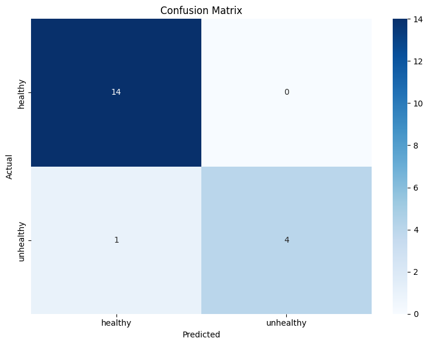

# Houseplant Health Classification Using Amazon Rekognition

*Catching plant disease early prevents inventory loss for nurseries and retailers; a false negative (missing a sick plant) is more costly than a false alarm, so the model needed to be tuned for that asymmetry, not just overall accuracy.*

**Problem:** Classify houseplant health (healthy vs. unhealthy) from images, using a managed computer vision service rather than a custom-trained model, while handling a small, imbalanced, self-collected dataset (91 images, only 24 unhealthy).

**Architecture decision:** Used Amazon Rekognition Custom Labels instead of training a model from scratch, prioritizing a production-style, serverless architecture over building custom CV infrastructure. Every AWS resource (S3, Rekognition, Lambda, IAM) was provisioned entirely through Python/Boto3 rather than manual console setup, keeping the whole pipeline reproducible from a single notebook. Corrected class imbalance through targeted augmentation (Albumentations) rather than accepting a biased training set, since the unhealthy class was both smaller and higher-stakes to miss.

**What broke:** The raw dataset's class imbalance (67 healthy vs. 24 unhealthy) risked a model that defaulted toward predicting "healthy." Augmenting to 201 training images specifically targeted this imbalance rather than just growing the dataset generically.

**Metric:** 0.95 overall accuracy on 19 holdout test images, with 1.00 precision / 0.80 recall on the unhealthy class, the metric that mattered most given the cost of a missed sick plant.


## Architecture
Local Images → S3 Upload → Rekognition Custom Labels Training
↓
New Image → S3 (uploads/) → Lambda → Rekognition Inference → S3 (results/)

## Tech Stack
- **Python** — data preparation, augmentation, pipeline orchestration
- **Amazon Rekognition Custom Labels** — image classification model
- **Amazon S3** — image and results storage
- **AWS Lambda** — serverless inference pipeline
- **IAM** — permissions and security
- **scikit-learn** — train/test split and model evaluation
- **Albumentations** — image augmentation
- **boto3** — AWS SDK for Python

## Dataset
- 91 original images (67 healthy, 24 unhealthy) collected from personal houseplants
- Augmented to 201 training images to address class imbalance
- 80/20 train/test split with stratification
- Available on Kaggle: [Houseplant Health Classification Dataset](https://www.kaggle.com/datasets/tarieretimitimi/houseplant-health-classification-dataset)

## Pipeline
1. Images organized into healthy/unhealthy folders
2. Train/test split (80/20) with stratification
3. Augmentation applied to training set only
4. Images uploaded to S3 with manifest files for Rekognition
5. Rekognition Custom Labels model trained on 201 images
6. Model evaluated against 19 holdout test images
7. Lambda function deployed for automated inference

## Results

### Classification Report
precision    recall  f1-score   support
   healthy       0.93      1.00      0.97        14
 unhealthy       1.00      0.80      0.89         5
  accuracy                           0.95        19
 macro avg       0.97      0.90      0.93        19
weighted avg       0.95      0.95      0.95        19

### Summary Table
| Metric | Healthy | Unhealthy |
|--------|---------|-----------|
| Precision | 0.93 | 1.00 |
| Recall | 1.00 | 0.80 |
| F1 Score | 0.97 | 0.89 |
| **Overall Accuracy** | **0.95** | |



## Setup

### Prerequisites
- AWS account with appropriate permissions
- Python 3.11+
- AWS CLI configured

### Installation
```bash
pip install boto3 Pillow scikit-learn albumentations matplotlib pandas numpy tqdm torch torchvision
```

### Running the Project
1. Clone the repo
2. Add your images to `data/healthy/` and `data/unhealthy/`
3. Run the notebook top to bottom
4. To tear down AWS resources run the cleanup cell at the bottom

## Acknowledgements
Training images were collected in person at two plant nurseries whose staff were kind enough to allow photography:
- **Holiday Foliage Orchids and Plants** — 146 West 28th Street, New York, NY
- **Redwood Flower Shop** — New Brunswick, NJ

## Reflection
The "right" metric depends on what a false negative actually costs in the real world. Optimizing for overall accuracy would have hidden exactly the failure mode that mattered most here.
